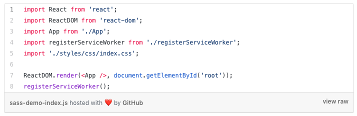
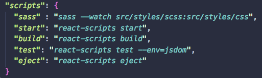
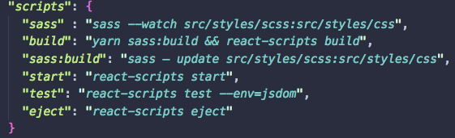

# React + Sass Project Template W/O Ejecting 
-------------------------------

- Create App that you want Sass integrated too 
  - create-react-app your-app-name
  - npm install create-react-app if you don't have
  - install globally with the **-g** flag
  ______________________________ 
- Change File Structure 
  |   |  Create                    |  
  -------------------|----------------------------: 
  |mkdir styles      | src/styles                 | 
  |mk css            | src/styles/css             | 
  |mk scss           | src/styles/scss            |  
  |mv index.css      | src/styles/scss/index.scss | 
  |mv App.css        | src/styles/scss/App.scss   | 
  ______________________________ 
|  Todo -CMDline | Create | 
| ------------- |:-------------:|
| mkdir styles | src/styles |
| mk css | src/styles/css      |  
| mk scss | src/styles/scss      |   


- Change `import './index.css'` in src/index.js;
  - Change to `import './styles/css/index.css';`
  - 
  ______________________________
- Watch and compile Sass to Css files, add the below snippet to the script section of the package.json file
 
  ```json 
  -  "sass" : "sass --watch src/styles/scss:src/styles/css" 
  ```
  - 
  ______________________________
- Building for production/depoloyment (Making the transpiling process easier)
  - Add the following script to your package.json file
    - `“sass:build”: “sass — update src/styles/scss:src/styles/css”`
  - Modify the existing script in your package.json file
    - `”build”: “yarn sass:build && react-scripts build”` 
    
  - 
 